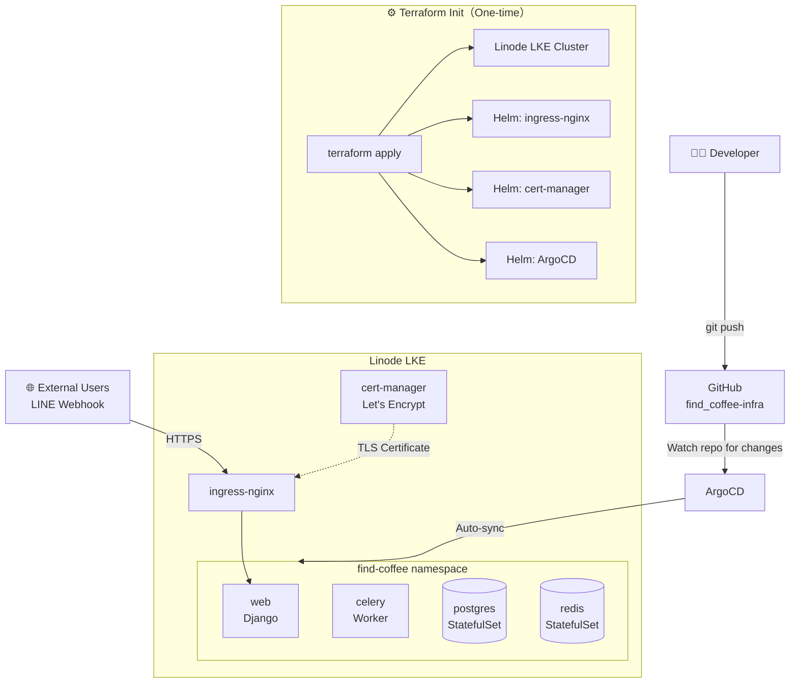
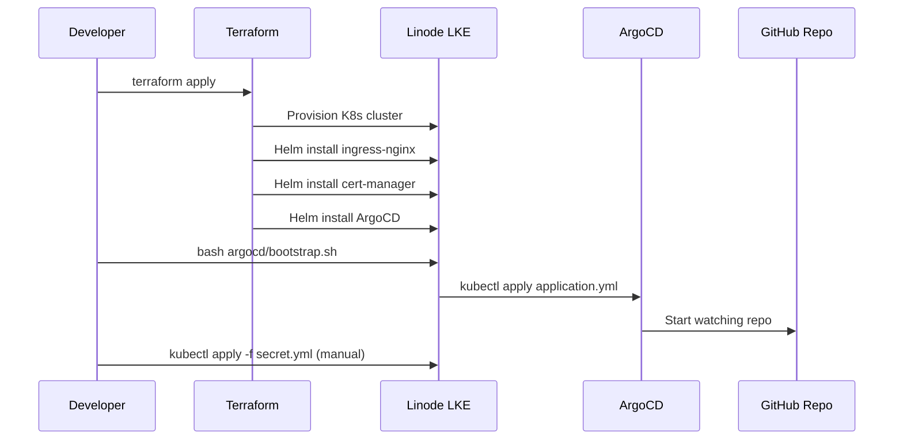
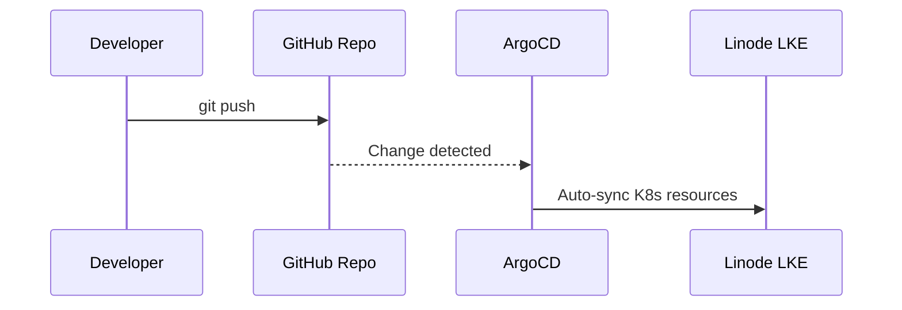

# find_coffee Infrastructure

[中文版本](README.md)

---

## Overview

This repository manages the **Infrastructure as Code** for the [`Find_Coffee`](https://github.com/KK-Huang86/Find_Coffee) application, following a GitOps workflow.

All Kubernetes resource changes are applied by simply pushing to this repo — ArgoCD automatically detects changes and deploys to the Linode LKE cluster.

---

## Architecture



---

## Deployment Flow

### First-time Setup



### Ongoing Deployments



---

## Why is bootstrap.sh needed the first time?

ArgoCD is installed by Terraform via Helm. Once installed, ArgoCD is running but has no idea which repository to watch.

`argocd/application.yml` defines the sync target, but it needs to be applied manually via `kubectl apply` to take effect.

`bootstrap.sh` handles this one-time step:

```bash
# Wait for ArgoCD server to be ready
kubectl rollout status deployment/argocd-server -n argocd

# Tell ArgoCD which repo to track
kubectl apply -f argocd/application.yml
```

After this, ArgoCD takes over all future deployments automatically.

---

## What Terraform manages

| Resource | Description |
|----------|-------------|
| Linode LKE Cluster | The Kubernetes cluster |
| Helm: ingress-nginx | Ingress controller, exposes services externally |
| Helm: cert-manager | Requests TLS certificates from Let's Encrypt |
| Helm: ArgoCD | GitOps controller |
| Kubernetes Secret | GitHub credentials for ArgoCD to read this repo |
| ClusterIssuer | cert-manager configuration for Let's Encrypt |

---

## What ArgoCD manages (K8s Manifests)

ArgoCD watches this repo based on `argocd/application.yml` and auto-applies the following:

```yaml
# argocd/application.yml key settings
path: .             # Scan from repo root
recurse: true       # Scan all subdirectories
exclude: '{terraform/**,argocd/**}'  # Skip Terraform and ArgoCD config files
```

| File | Kind | Description |
|------|------|-------------|
| `namespace.yml` | Namespace | find-coffee namespace |
| `configmap.yml` | ConfigMap | App environment variables (DB host, Redis URL, etc.) |
| `web/deployment.yml` | Deployment | Django web server (2 replicas) |
| `web/service.yml` | Service | ClusterIP for web |
| `celery/deployment.yml` | Deployment | Celery worker |
| `postgres/statefulset.yml` | StatefulSet | PostgreSQL with persistent storage |
| `postgres/service.yml` | Service | ClusterIP for postgres |
| `redis/statefulset.yml` | StatefulSet | Redis with persistent storage |
| `redis/service.yml` | Service | ClusterIP for redis |
| `ingress.yml` | Ingress | External routing with TLS |

> `secret.yml` is **not committed to Git** — apply it manually with `kubectl apply -f secret.yml`

---

## Directory Structure

```
find_coffee-infra/
├── terraform/           # Provision LKE cluster and install Helm charts
│   ├── main.tf
│   ├── providers.tf
│   ├── variables.tf
│   ├── outputs.tf
│   ├── helm.tf
│   ├── argocd-repo.tf
│   └── cluster-issuer.tf
├── argocd/              # ArgoCD config (excluded from ArgoCD sync to avoid loop)
│   ├── application.yml
│   └── bootstrap.sh
├── web/
├── celery/
├── postgres/
├── redis/
├── configmap.yml
├── ingress.yml
├── namespace.yml
└── secret.yml           # NOT committed to Git
```
