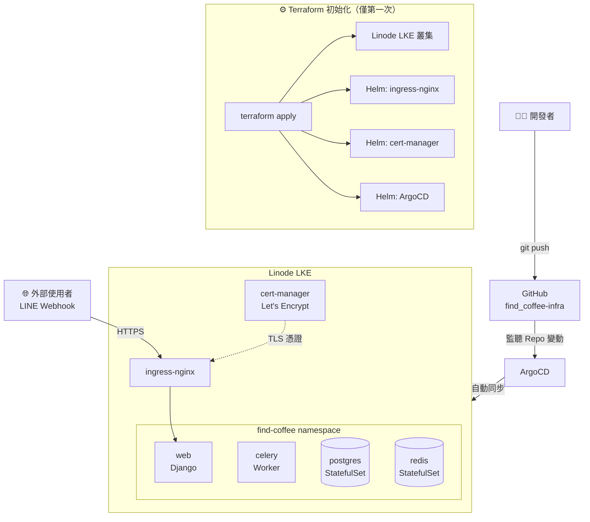
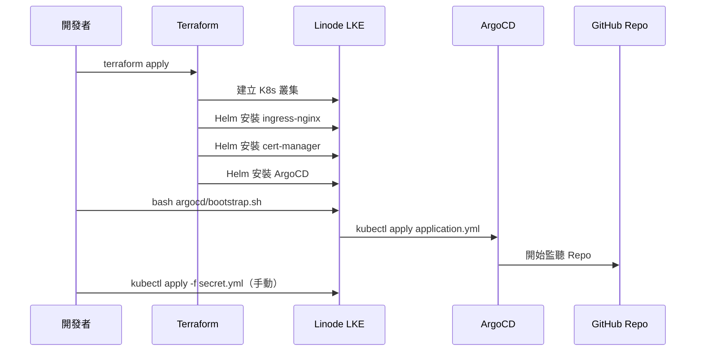
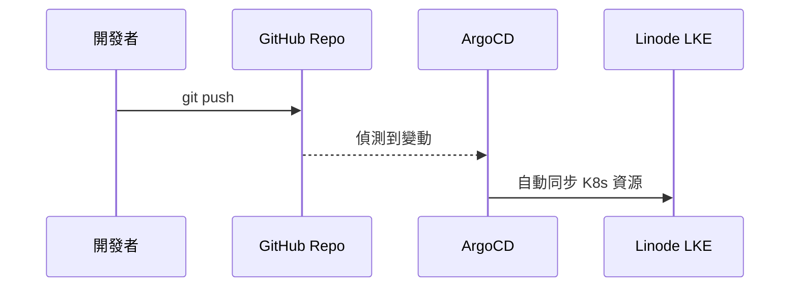

# find_coffee Infrastructure

[English Version](README.en.md)

---

## 概述

本 Repo 負責管理 [`Find_Coffee`](https://github.com/KK-Huang86/Find_Coffee) 應用程式的 **基礎設施即程式碼（Infrastructure as Code）**，採用 GitOps 模式運作。

所有 K8s 資源的變更只需推送到此 Repo，ArgoCD 會自動偵測並部署至 Linode LKE 叢集。

---

## 架構



---

## 部署流程

### 第一次建置（One-time Setup）



### 日常部署



---

## 為什麼第一次需要 bootstrap.sh？

ArgoCD 是由 Terraform 透過 Helm 安裝的，安裝完成後 ArgoCD 剛啟動，尚未知道要追蹤哪個 Repo。

`argocd/application.yml` 定義了追蹤目標，但需要有人主動 `kubectl apply` 才能生效。

`bootstrap.sh` 負責這個一次性步驟：

```bash
# 等 ArgoCD server 啟動完成
kubectl rollout status deployment/argocd-server -n argocd

# 告訴 ArgoCD 要追蹤這個 Repo
kubectl apply -f argocd/application.yml
```

套用之後，ArgoCD 自動接管後續所有部署，不需要再執行此腳本。

---

## Terraform 管理的資源

| 資源 | 說明 |
|------|------|
| Linode LKE Cluster | K8s 叢集本體 |
| Helm: ingress-nginx | 流量入口，對外暴露服務 |
| Helm: cert-manager | 向 Let's Encrypt 申請 TLS 憑證，啟用 HTTPS |
| Helm: ArgoCD | GitOps 控制器 |
| Kubernetes Secret | ArgoCD 用來讀取此 Repo 的 GitHub 憑證 |
| ClusterIssuer | cert-manager 的 Let's Encrypt 設定 |

---

## ArgoCD 管理的資源（K8s Manifests）

ArgoCD 根據 `argocd/application.yml` 追蹤此 Repo，並自動套用以下資源：

```yaml
# argocd/application.yml 關鍵設定
path: .             # 從 Repo 根目錄掃描
recurse: true       # 掃描所有子資料夾
exclude: '{terraform/**,argocd/**}'  # 排除 Terraform 和 ArgoCD 設定檔
```

| 檔案 | 資源類型 | 說明 |
|------|----------|------|
| `namespace.yml` | Namespace | find-coffee namespace |
| `configmap.yml` | ConfigMap | 應用程式環境變數（DB host、Redis URL 等） |
| `web/deployment.yml` | Deployment | Django web server（2 replicas） |
| `web/service.yml` | Service | web 的 ClusterIP |
| `celery/deployment.yml` | Deployment | Celery worker |
| `postgres/statefulset.yml` | StatefulSet | PostgreSQL 資料庫（持久化儲存） |
| `postgres/service.yml` | Service | postgres 的 ClusterIP |
| `redis/statefulset.yml` | StatefulSet | Redis（持久化儲存） |
| `redis/service.yml` | Service | redis 的 ClusterIP |
| `ingress.yml` | Ingress | 對外路由，啟用 TLS |

> `secret.yml` 不在 Git 中，需手動執行 `kubectl apply -f secret.yml`

---

## 目錄結構

```
find_coffee-infra/
├── terraform/           # 建立 LKE 叢集與安裝 Helm charts
│   ├── main.tf
│   ├── providers.tf
│   ├── variables.tf
│   ├── outputs.tf
│   ├── helm.tf
│   ├── argocd-repo.tf
│   └── cluster-issuer.tf
├── argocd/              # ArgoCD 設定（被 exclude，不被 ArgoCD 追蹤）
│   ├── application.yml
│   └── bootstrap.sh
├── web/
├── celery/
├── postgres/
├── redis/
├── configmap.yml
├── ingress.yml
├── namespace.yml
└── secret.yml           # 不進 Git
```
